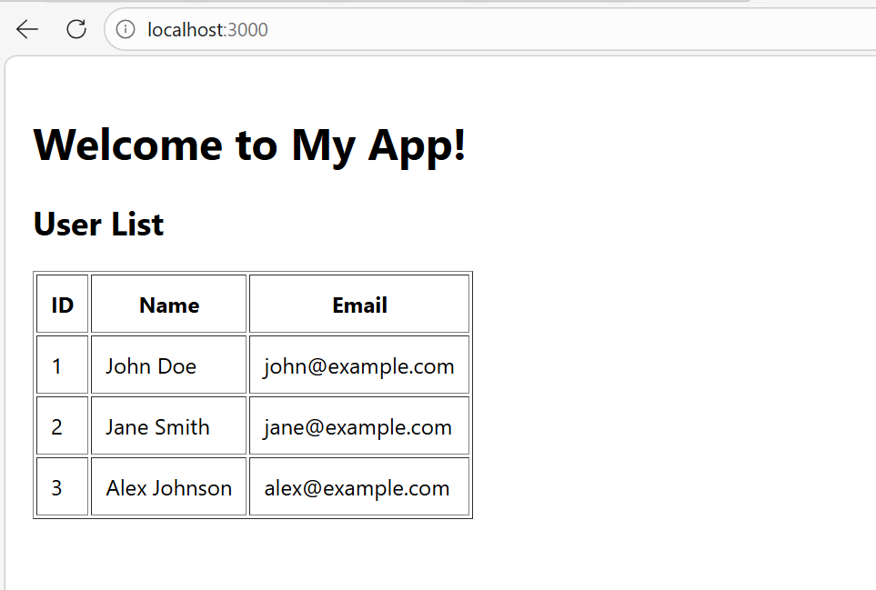

# 🚀 Fullstack Docker Demo

A complete full-stack demo application built with **React (frontend)**, **Node.js/Express (backend)**, and **PostgreSQL (database)**.  
All services are containerized with **Docker** and orchestrated using **Docker Compose** for easy reproducibility.

---

## ✨ Features
- 🔹 **Frontend**: React app served on port `3000`
- 🔹 **Backend**: Node.js REST API served on port `5001`
- 🔹 **Database**: PostgreSQL seeded with sample users via `init.sql`
- 🔹 **Dockerized**: Each service packaged as a Docker image
- 🔹 **One command setup**: `docker-compose up` brings the entire stack online

---

## 📦 Docker Hub Images
- Frontend → [`sujithmurali/myapp-frontend:v1`](https://hub.docker.com/r/sujithmurali/myapp-frontend)
- Backend → [`sujithmurali/myapp-backend:v1`](https://hub.docker.com/r/sujithmurali/myapp-backend)
- Database → [`sujithmurali/myapp-db:v1`](https://hub.docker.com/r/sujithmurali/myapp-db)

---

## 🚀 Quick Start

### Prerequisites
- Install [Docker](https://docs.docker.com/get-docker/)  
- Install [Docker Compose](https://docs.docker.com/compose/)

### Steps
1. Clone the repository:
   ```bash
   git clone https://github.com/sujithmurali/fullstack-docker-demo.git
   cd fullstack-docker-demo

2. 	Start the stack:
    docker-compose up
3. 	Access the services:
• 	Frontend → http://localhost:3000
• 	Backend API → http://localhost:5001/api/users


==============================================
project structure

fullstack-docker-demo/
├── backend/        # Node.js API
│   └── Dockerfile
├── frontend/       # React app
│   └── Dockerfile
├── docker/         # Custom Postgres Dockerfile + init.sql
│   ├── Dockerfile
│   └── db-init/init.sql
└── docker-compose.yml

=============================================================

Database SeedingThe database is initialized with sample users via init.sql.
On first run, PostgreSQL executes this script automatically, so the backend API immediately returns seeded data.🛠 Development Notes- Backend port mapping: 5001 (host) → 5000 (container)
- Environment variables for DB connection are defined in docker-compose.yml:
DB_HOST: db
DB_PORT: 5432
DB_USER: postgres
DB_PASSWORD: password
DB_NAME: myappdb

📸 Screenshots

